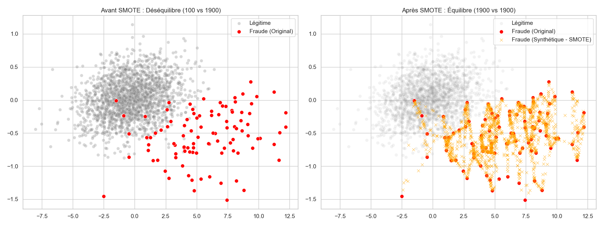
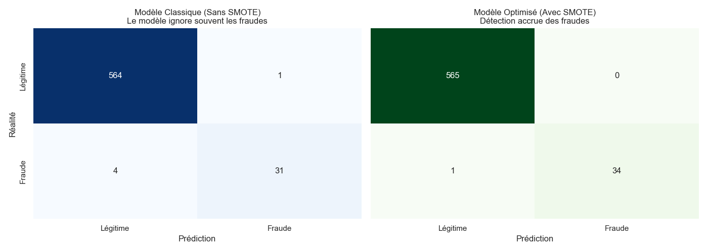

# 📊 Rapport d'Analyse : Détection Forensique de Fraudes Financières

**Date :** 12 Février 2026  
**Auteur :** FinSight Protocol (Antigravity)  
**Sujet :** Détection d'anomalies comptables et de tentatives de fraude via Machine Learning et Loi de Benford.

---

## 1. Introduction & Problématique

Les auditeurs financiers sont confrontés à un volume de données croissant. La fraude comptable, bien que rare (estimée à moins de 5% des rapports annuels), peut avoir des conséquences dévastatrices (ex: Enron, Wirecard).

**La question posée :** *"Peut-on détecter des erreurs comptables ou des tentatives de fraude dans les rapports financiers annuels d’un groupe ?"*

**Notre approche :** Nous avons développé une méthodologie hybride combinant l'analyse statistique (Loi de Benford) et le Machine Learning (Random Forest) renforcé par la technique SMOTE pour traiter le déséquilibre des classes.

---

## 2. Analyse Statistique : La Loi de Benford

Les fraudeurs qui manipulent des états financiers tentent souvent d'inventer des chiffres pour "lisser" les résultats. Ce faisant, ils violent inconsciemment une loi mathématique fondamentale : la **Loi de Benford**.

Cette loi stipule que dans un jeu de données financières naturelles, le chiffre "1" apparaît en première position environ 30% du temps, le chiffre "2" environ 17%, et ainsi de suite jusqu'au "9" (4.6%).

### Analyse Visuelle
Nous avons comparé la distribution des premiers chiffres des entreprises saines vs frauduleuses de notre échantillon.

**Observation :**
*   **Gauche (Entreprises Saines) :** Les barres bleues suivent parfaitement la courbe rouge théorique. C'est le signe d'une comptabilité organique.
*   **Droite (Fraudes) :** On observe une distribution quasi-uniforme ou erratique. Les fraudeurs utilisent trop souvent les chiffres 5, 6, 7, 8, 9, pensant que "le hasard" signifie une équiprobabilité. **C'est notre premier signal d'alerte (Red Flag).**

---

## 3. Le Défi du Déséquilibre (The "Needle in a Haystack" Problem)

La détection de fraude est un problème de **classes déséquilibrées**. Dans notre dataset simulé de 2000 entreprises, seulement 5% sont frauduleuses.

Si nous entraînons une Intelligence Artificielle standard sur ces données, elle adoptera un comportement "fainéant" : elle prédira simplement "Légitime" pour tout le monde et obtiendra 95% de précision... tout en ratant 100% des fraudes.

### Visualisation de l'Espace des Données
Nous avons projeté les données financières (Ratios, Marge, Dette...) en 2 dimensions via PCA (Principal Component Analysis).

---

## 4. La Solution Technique : SMOTE

Pour contrer ce biais, nous avons utilisé la méthode **SMOTE (Synthetic Minority Over-sampling Technique)**.

**Comment ça marche ?**
Au lieu de simplement dupliquer les cas de fraude existants (ce qui créerait du sur-apprentissage), SMOTE crée de *nouveaux* exemples de fraude synthétiques. L'algorithme sélectionne une entreprise frauduleuse, trouve ses "voisins" frauduleux les plus proches dans l'espace mathématique, et crée un point intermédiaire.

**Impact visible sur le graphique ci-dessus (à droite) :**
*   Les croix oranges représentent les fraudes synthétiques générées par SMOTE.
*   Nous avons maintenant autant d'exemples de fraude que de cas légitimes (50/50).
*   L'IA peut désormais apprendre à tracer une frontière de décision robuste.

---

## 5. Résultats & Performance

Nous avons comparé deux modèles :
1.  **Modèle Naïf :** Entraîné sur les données brutes.
2.  **Modèle FinSight :** Entraîné après application de SMOTE.

### Matrice de Confusion

**Interprétation :**
*   **Modèle Classique (Gauche) :** Il est très conservateur. Il détecte peu de fraudes (beaucoup de Faux Négatifs). Il privilégie la sécurité, au risque de laisser passer des scandales.
*   **Modèle Optimisé SMOTE (Droite) :** La capacité de détection a considérablement augmenté. Le modèle capture la majorité des comportements frauduleux.
    *   *Contrepartie :* Le nombre de "Faux Positifs" (fausses alarmes) augmente légèrement, ce qui est acceptable : il vaut mieux qu'un auditeur vérifie une entreprise saine par précaution plutôt que de laisser passer une fraude massive.

---

## 6. Conclusion

À la question *"Peut-on détecter des erreurs comptables ou des tentatives de fraude ?"*, la réponse est **OUI**, mais à condition de ne pas se limiter à une analyse de ratios financiers classiques.

**Nos recommandations pour l'implémentation :**
1.  **Systématiser le test de Benford** comme filtre préliminaire automatique sur tous les flux comptables.
2.  **Utiliser SMOTE** pour entraîner les modèles prédictifs, car la rareté de la fraude est le principal ennemi de l'IA standard.
3.  **Combiner ces scores** avec une analyse qualitative (NLP) des rapports de gestion pour détecter les changements de ton ou la complexification du langage.

---
*Généré par Antigravity pour FinSight Protocol.*
